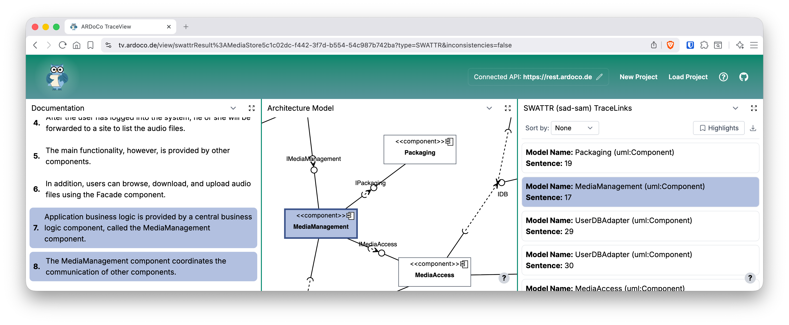

# ARDoCo TraceView

**TraceView** is a browser-based, installation-free frontend for [ARDoCo](https://github.com/ardoco/ardoco)'s traceability link recovery (TLR) pipelines.
It is part of the [ARDoCo tool landscape](https://ardoco.de) and is publicly available at **[tv.ardoco.de](https://tv.ardoco.de)**.



TraceView visualizes recovered trace links and detected inconsistencies between software architecture documentation (SAD), architecture models (SAM), and source code.
Its interactive multi-panel layout lets users explore all three artifact types simultaneously and navigate across them by clicking on any element.

---

## Features

- **Guided project wizard** — four-step wizard for uploading artifacts (SAD, SAM, code model), naming the project, selecting a TLR pipeline, and reviewing before submission
- **Supported pipelines** — SAD-SAM (SWATTR), SAM-Code (ArCoTL), SAD-Code (ArDoCode), and transitive SAD-SAM-Code (TransArC)
- **Multi-panel result view** — up to three resizable, side-by-side panels for SAD, SAM, and source code
- **Cross-artifact highlighting** — selecting any trace link highlights the linked elements across all open panels
- **Inconsistency detection** — TEAM (Text Entity Absent from Model) and MEAT (Model Entity Absent from Text) results shown alongside trace links
- **No local installation required** — communicates with the [ARDoCo REST API](https://rest.ardoco.de)

---

## Tech Stack

- [Next.js](https://nextjs.org) / [React](https://react.dev) (TypeScript)
- [Tailwind CSS](https://tailwindcss.com)
- [D3.js](https://d3js.org) for architecture model rendering
- [Headless UI](https://headlessui.com) for accessible UI primitives

---

## Getting Started

### Development

```bash
npm install
npm run dev
```

Open [http://localhost:3000](http://localhost:3000) in your browser.

### Production build

```bash
npm run build
npm start
```

### Docker

```bash
docker build -t traceview2 .
docker run -p 3000:3000 traceview2
```

Or use the provided Docker Compose template:

```bash
cp docker-compose-template.yml docker-compose.yml
docker compose up -d
```

