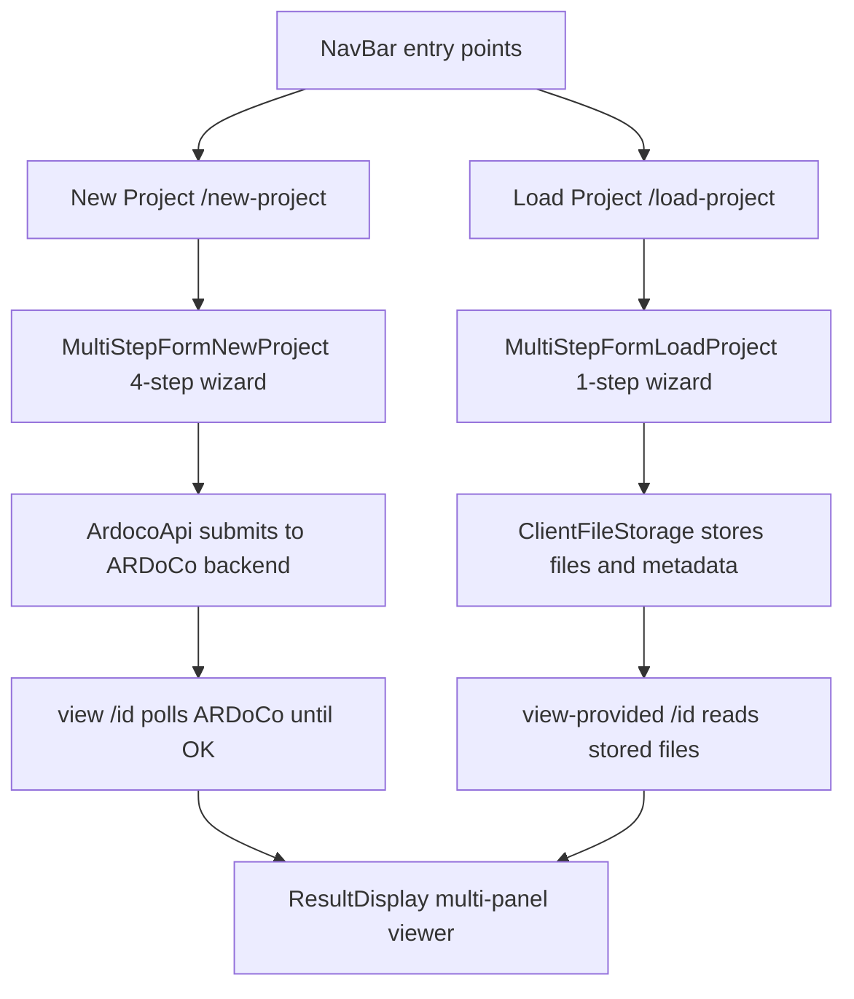
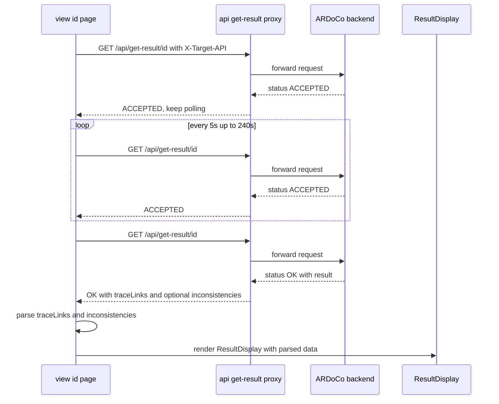

# Workflows

This repository's user journeys center on two parallel flows that both end in the same result viewer: create a new project and submit it to ARDoCo, or load an existing project whose trace links are already computed. Both entry points are exposed in the top navigation (`src/components/NavBar.tsx`).

The two submission paths converge on the same `ResultDisplay`, but the new-project path depends on an ARDoCo backend while the load-project path relies entirely on browser-side storage.

## 1. Landing page and navigation

The home page in `src/app/page.tsx` introduces ARDoCo Trace View and sends the user to `/new-project` through the primary Start button. The landing page is intentionally simple: it frames the product as a traceability and consistency-analysis UI and routes users into the wizard.

The persistent `NavBar` (`src/components/NavBar.tsx`) offers two in-app entry points: **New Project** (`/new-project`) and **Load Project** (`/load-project`), plus external About/GitHub links. The Load Project entry point begins the provided-result flow described in section 6.

## 2. Guided project setup

`src/app/new-project/page.tsx` wraps the upload wizard in `FormProvider` and filters allowed file types to exclude trace-link and inconsistency result files from the initial upload flow.

`src/components/multiStepForm/MultiStepFormNewProject.tsx` implements the four-step process:

1. Upload Files
2. Project Details
3. Configuration
4. Summary

The wizard validates each step before allowing progress. The last step submits the payload to the backend and redirects to `/view/{requestId}` with query parameters for the selected trace-link type and the inconsistencies toggle.

## 3. Request construction and submission

`src/util/ArdocoApi.tsx` is the canonical place for submission rules. It builds the multipart payload based on the chosen trace-link type:

- SAD-SAM-Code requires code, documentation, and an architecture model.
- SAD-Code requires code and documentation.
- SAM-Code requires code and an architecture model.
- SAD-SAM requires documentation and an architecture model.

If the user enables inconsistency detection, the code restricts that path to SAD-SAM and uses the dedicated `/api/find-inconsistencies/start` endpoint.

The upload context also fetches backend configuration from `/api/configuration`, so configuration is available during the wizard.

## 4. Result polling and display

`src/app/view/[id]/page.tsx` handles the asynchronous response lifecycle. It repeatedly polls `/api/get-result/{id}` until the backend responds with `OK`.

While waiting, the page shows a loading banner. If the backend returns an error, the page surfaces a modal with retry and fallback options.

Once data arrives, the page:

- parses trace links
- optionally parses inconsistencies
- sets the current project ID in navigation context
- renders the `ResultDisplay`

Polling uses a 5-second interval and a 240-second (4 minute) maximum; after that the page raises a timeout error surfaced in the error modal.

## 5. Multi-panel result exploration

`src/components/traceLinksResultViewer/ResultDisplay.tsx` renders up to three panels side by side using `react-resizable-panels`.

The result viewer supports:

- cross-artifact highlighting
- fullscreen per-view exploration
- a separate inconsistencies view when requested
- trace-link search/result messaging

This area is the main UX for inspecting recovered links across documentation, architecture, and code.

## 6. Load existing project (provided result path)

The load-project flow is an alternative to running ARDoCo. It lets a user visualize pre-computed trace links (and optional inconsistencies) that they already have on hand, without a backend round trip.

`src/app/load-project/page.tsx` wraps the load wizard in `FormProvider` and, unlike new-project, allows all `FileType` values including trace-link and inconsistency result files. `src/components/multiStepForm/MultiStepFormLoadProject.tsx` implements a single-step process:

1. Upload the project files and the JSON file containing the trace links (plus optional inconsistency JSON).

Validation runs through `FormValidation.validateExistingProject`, which requires a project name, a selected trace-link type, and files. On submit the form generates a client-side UUID storage ID, persists the files and metadata via `storeProjectFiles` / `storeProjectMetadata` from `src/util/ClientFileStorage.tsx`, and redirects to `/view-provided/{encodedId}`.

`src/app/view-provided/[id]/page.tsx` is the result path for loaded projects. Instead of polling ARDoCo it reads the stored trace-link and inconsistency files from `ClientFileStorage`, parses them with the same parsers used by the polling view, sets the current project ID in the navigation context, and renders the same `ResultDisplay` used for new-project runs. The trace-link type and the set of available views are derived from the stored metadata and the uploaded file types rather than from query parameters.

## Things to watch when changing workflows

- Preserve the query parameters passed from new-project submission to `/view/[id]`; they determine which result views are enabled on the polling path.
- The load-project flow does not use those query parameters; it derives its views from stored metadata. Keep that distinction intact when touching either result page.
- Keep the inconsistency path aligned with the trace-link type restrictions in `src/util/ArdocoApi.tsx` and `src/contexts/ProjectUploadContext.tsx`.
- Both submission flows share `ClientFileStorage` and the same result viewer; changes to file naming or metadata format affect both new-project review and load-project visualization.
- If step order or validation changes, update both the wizard component and the explanatory copy on the home page and quickstart.
